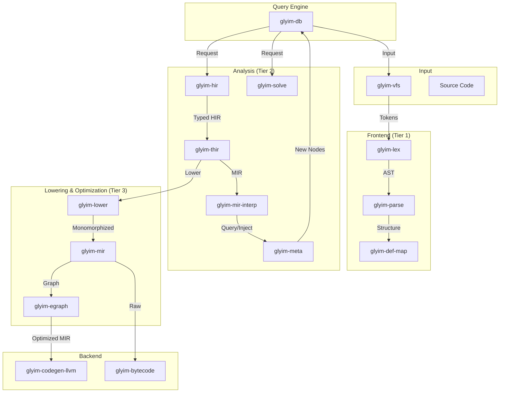

```markdown
# Glyim Architecture Specification

**Document Version:** 1.0.0  
**Status:** Draft  
**Date:** 2025-04-10  
**Author:** Language Design Team

---

## Table of Contents

1. [Introduction & Scope](#1-introduction--scope)
2. [System Context & Stakeholders](#2-system-context--stakeholders)
3. [Architecturally Significant Requirements (ASRs)](#3-architecturally-significant-requirements-asrs)
4. [Architectural Drivers & Quality Attributes](#4-architectural-drivers--quality-attributes)
5. [High-Level Architecture](#5-high-level-architecture)
6. [Component Architecture](#6-component-architecture)
7. [Data Architecture & Intermediate Representations](#7-data-architecture--intermediate-representations)
8. [Key Architectural Decisions (ADRs)](#8-key-architectural-decisions-adrs)
9. [Traceability Matrix](#9-traceability-matrix)

---

## 1. Introduction & Scope

This document defines the high-level architecture for the **Glyim** compiler and toolchain. Glyim is a "Tier 1" systems programming language designed to bridge the gap between Pythonic ergonomics, Haskell's type theory, and Rust's memory safety.

The architecture prioritizes three non-negotiable goals:
1.  **Invisible Safety:** Memory safety via an affine type system that does not hinder the "scripting feel" of the language.
2.  **State-of-the-Art Tooling:** IDE support (LSP) must feel instantaneous, powered by a tiered incremental compilation model.
3.  **First-Class Metaprogramming:** Compile-time execution is not a preprocessor phase; it is an integral part of the language execution model.

This specification covers the compiler internal design (`glyim-*` crates), the intermediate representations (IRs), and the integration of the query-based database engine that drives the system.

---

## 2. System Context & Stakeholders

### 2.1 Actors
The Glyim compiler interacts with three primary actors:

| Actor | Role | Interaction Point |
| :--- | :--- | :--- |
| **Developer** | Writes Glyim code, expects fast feedback and clear errors. | `glyim-cli`, `glyim-lsp` |
| **Integrator** | Builds Glyim libraries, links with C/C++/Rust. | `glyim-codegen`, `glyim-build` |
| **System Builder** | Embeds Glyim (e.g., in a game engine or firmware). | `glyim-runtime`, `glyim-bytecode` |

### 2.2 Operational Context
Glyim is designed to operate in modern CI/CD environments with heavy emphasis on caching.
*   **Tier 1 (Syntax):** Sub-100ms latency for file opening in IDEs.
*   **Tier 2 (Analysis):** Sub-2s latency for type checking changes.
*   **Tier 3 (Codegen):** Heavy lifting, distributed via `glyim-orchestrator` where necessary.

---

## 3. Architecturally Significant Requirements (ASRs)

These requirements drive the major structural decisions of the compiler.

*   **ASR-PERF-001 (Invisible Borrow Checking):** The borrow checker must be dataflow-based (Polonius-style) rather than lexical. It must support non-lexical lifetimes (NLL) to avoid common "fighting the compiler" scenarios found in Rust.
*   **ASR-INCR-002 (Tiered Incremental Compilation):** The compiler must be capable of delivering results in tiers. Changing a comment in a file must not trigger type checking of dependencies. Changing a type signature must only trigger re-analysis of dependents, not monomorphization.
*   **ASR-META-003 (First-Class Comptime):** Functions marked `comptime` are executed by a MIR interpreter embedded in the compiler. This allows users to generate AST nodes and query types during compilation.
*   **ASR-MOD-004 (Module System from the Get-Go):** The module system (`glyim-def-map`) must be queryable without parsing function bodies. This enables fast dependency resolution for the LSP.
*   **ASR-OPT-005 (Equality Saturation):** The optimizer must utilize E-Graphs to perform aggressive algebraic simplification and loop optimization on a generic representation before lowering to machine code.

---

## 4. Architectural Drivers & Quality Attributes

| Attribute | Priority | Description |
| :--- | :--- | :--- |
| **Performance** | High | Use `rayon` for parallelism in heavy lifting steps (type checking, monomorphization). |
| **Modularity** | High | Crates must have strict boundaries. `glyim-syntax` must never depend on `glyim-typeck`. |
| **Observability** | High | Every query in `glyim-db` must be instrumentable to identify compilation bottlenecks. |
| **Extensibility** | Medium | Backend must be abstracted (`glyim-codegen`) to allow Cranelift or GCC backends in the future. |
| **Correctness** | Critical | The borrow checker (`glyim-borrowck`) must be sound; gaps are unacceptable. |

---

## 5. High-Level Architecture

The Glyim compiler follows a **Query-Based Compilation** model. The central nervous system is `glyim-db`, which implements a Salsa-like query engine.



### 5.1 The Compilation Loop
1.  **Input:** The VFS detects a file change.
2.  **Query:** `glyim-db` invalidates dependent queries.
3.  **Execution:**
    *   If `Syntax` is requested: Run `glyim-lex` -> `glyim-parse` -> `glyim-def-map`.
    *   If `TypeCheck` is requested: Run `glyim-typeck` -> `glyim-thir`.
    *   If `Comptime` is detected: `glyim-thir` lowers to `glyim-mir` and `glyim-mir-interp` executes it, potentially injecting new AST nodes (looping back to `glyim-parse` via `glyim-meta`).
    *   If `Codegen` is requested: `glyim-mono` monomorphizes, `glyim-egraph` optimizes, `glyim-codegen-llvm` generates objects.

---

## 6. Component Architecture

The workspace is divided into layers. Dependencies strictly flow downwards.

### 6.1 Layer 0: Foundation
*   **`glyim-interner`**: String interning.
*   **`glyim-span`**: Source locations and hygiene context.
*   **`glyim-db`**: The Salsa query engine.

### 6.2 Layer 1: Frontend
*   **`glyim-vfs`**: Abstraction over file system.
*   **`glyim-lex`**: Lexer.
*   **`glyim-parse`**: Parser (Syntax -> AST).
*   **`glyim-def-map`**: Module graph (The "Tier 1" fast path).

### 6.3 Layer 2: Metaprogramming
*   **`glyim-meta`**: The compiler API exposed to user code.
*   **`glyim-mir-interp`**: The MIR interpreter for `comptime`.
*   **`glyim-hygiene`**: Hygiene resolution logic.

### 6.4 Layer 3: Analysis
*   **`glyim-infer`**: Type inference engine.
*   **`glyim-solve`**: Trait solver (Chalk-style logic).
*   **`glyim-typeck`**: Type checking logic.
*   **`glyim-thir`**: Typed HIR (Generic optimization target).
*   **`glyim-lower`**: Driver for IR lowering.
*   **`glyim-mir`**: Mid-level IR (CFG, Monomorphized).
*   **`glyim-lifetime`**: Region-based borrow checker (Polonius).
*   **`glyim-borrowck`**: Borrow checker utilizing lifetime analysis.
*   **`glyim-egraph`**: Equality saturation optimizer.

### 6.5 Layer 4: Backend
*   **`glyim-codegen`**: Backend trait definitions.
*   **`glyim-codegen-llvm`**: LLVM implementation.
*   **`glyim-bytecode`**: Custom bytecode format.

### 6.6 Layer 5: Tools & Runtime
*   **`glyim-diag`**: Error reporting.
*   **`glyim-lsp`**: Language Server Protocol.
*   **`glyim-cli`**: Command line interface.
*   **`glyim-runtime`**: Standard library runtime (panics, allocation).
*   **`glyim-test`**: Test harness (with coverage utils).

---

## 7. Data Architecture & Intermediate Representations

Glyim utilizes a "Ladder" of Intermediate Representations (IRs) to bridge the gap between high-level syntax and low-level code.

### 7.1 The IR Ladder

1.  **AST (Abstract Syntax Tree):**
    *   *Crate:* `glyim-syntax`
    *   *Characteristics:* Lossless, preserves comments, hygiene-aware (`SyntaxContext`). Used for diagnostics and formatting.

2.  **HIR (High-Level IR):**
    *   *Crate:* `glyim-hir`
    *   *Characteristics:* Desugared (no list comprehensions, pattern matches expanded), but **UnTyped** or partially typed. Generics are still abstract.

3.  **THIR (Typed High-Level IR):**
    *   *Crate:* `glyim-thir`
    *   *Characteristics:* Fully typed, but **Generic**.
    *   *Purpose:* This is the "Sweet Spot." It allows us to run optimizations (like inlining constant functions) before monomorphization, reducing code bloat. It feeds directly into `glyim-mono`.

4.  **MIR (Mid-Level IR):**
    *   *Crate:* `glyim-mir`
    *   *Characteristics:* Monomorphized (Generics replaced by concrete types), Control Flow Graph (CFG), Static Single Assignment (SSA) form.
    *   *Purpose:* Input to Borrow Checking and LLVM Codegen.

### 7.2 Data Flow Analysis (The "Invisible" Checker)
To achieve **ASR-PERF-001**, the borrow checker uses a dataflow framework (`glyim-lifetime`).
*   It does not rely on syntax (lifetimes).
*   It builds a control flow graph from MIR.
*   It computes "Regions" where variables are live.
*   **`glyim-borrowck`** validates that borrows do not overlap within these regions.

---

## 8. Key Architectural Decisions (ADRs)

### ADR-0001: Database-Driven Architecture
**Status:** Accepted  
**Context:** Need for incremental compilation and fine-grained invalidation.  
**Decision:** Use a Salsa-style query engine (`glyim-db`) as the central coordinator. All compiler phases are queries.  
**Consequences:**
*   (+) Enables `ASR-INCR-002` (Tiered compilation).
*   (+) Simplifies LSP implementation (shares logic with CLI).
*   (-) Adds complexity to crate dependencies (cyclic dependency risk).
*   (-) Harder to debug performance issues in the query graph.

### ADR-0002: THIR for Generic Optimization
**Status:** Accepted  
**Context:** Optimizing generic functions before monomorphization improves compile times and binary size (avoiding code bloat).  
**Decision:** Introduce a dedicated `glyim-thir` crate. Type checking produces THIR; `glyim-mono` consumes THIR.  
**Consequences:**
*   (+) Enables E-Graph optimizations on generic code.
*   (-) Increases memory footprint during compilation (extra IR layer).

### ADR-0003: MIR Interpreter for Comptime
**Status:** Accepted  
**Context:** Requirement `ASR-META-003`. Text-based macro expansion is insufficient for Turing-complete metaprogramming.  
**Decision:** Implement `glyim-mir-interp`. `comptime` functions lower to MIR and are executed in-process.  
**Consequences:**
*   (+) Full language power available at compile time.
*   (+) Type-safe code generation.
*   (-) Comptime code execution speed becomes a critical path for compilation performance.

### ADR-0004: Separated Trait Solver
**Status:** Accepted  
**Context:** Haskell-style type classes require complex solving ("Chalk" logic). Mixing this into the typechecker creates a monolithic, unmaintainable crate.  
**Decision:** Extract logic into `glyim-solve`. `glyim-typeck` queries `glyim-solve` for trait resolution.  
**Consequences:**
*   (+) Separation of concerns (Solver logic vs Type checking logic).
*   (+) Easier to test solver in isolation.

---

## 9. Traceability Matrix

This matrix maps the Architecturally Significant Requirements to the specific crates and architectural decisions responsible for satisfying them.

| ASR | Component(s) | ADR | Verification Method |
|:---|:---|:---|:---|
| **ASR-PERF-001** (Invisible Safety) | `glyim-mir`, `glyim-lifetime`, `glyim-borrowck` | ADR-0004 (Trait Solver) ensures safety traits are respected. | Test: `mir-borrowck` tests suite. |
| **ASR-INCR-002** (Tiered Incr. Comp) | `glyim-db`, `glyim-def-map` | ADR-0001 (Database-Driven) enables tiered queries. | Metric: IDE typecheck latency < 500ms. |
| **ASR-META-003** (First-Class Comptime) | `glyim-mir-interp`, `glyim-meta`, `glyim-lower` | ADR-0003 (MIR Interpreter) defines the execution model. | Test: Macro execution correctness suite. |
| **ASR-MOD-004** (Module System) | `glyim-def-map`, `glyim-parse` | N/A (Foundational Design) | Test: Dependency resolution benchmarks. |
| **ASR-OPT-005** (E-Graph Opt) | `glyim-thir`, `glyim-egraph`, `glyim-mono` | ADR-0002 (THIR) exposes generic code to optimizer. | Metric: Binary size reduction vs naive monomorphization. |

---

## Appendix A: Module System Details

To support **ASR-MOD-004**, the `glyim-def-map` crate is responsible for the "Definition Map". This is a lightweight data structure that can be computed *without* type checking function bodies.

*   **Inputs:** Parsed AST from `glyim-parse`.
*   **Outputs:** A map of `ModuleId` -> `ItemScope`.
*   **Usage:** The LSP uses this to provide "Go to Definition" without waiting for type checking.
```rust
// Conceptual API
pub struct CrateDefMap {
    pub root: ModuleId,
    pub modules: HashMap<ModuleId, ModuleData>,
}

pub struct ModuleData {
    pub parent: Option<ModuleId>,
    pub children: HashMap<Name, ModuleId>,
    pub scope: ItemScope, // Only Names/IDs, NO TYPES
}
```
