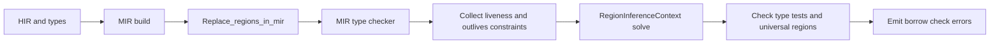

Here’s a research‑style overview of how a “state‑of‑the‑art” borrow checker is implemented, grounded in what Rust actually does and where it’s heading.

---

## 1. What “state of the art” means here

For Rust-like systems, a state‑of‑the‑art borrow checker is essentially:

1. **MIR‑based and flow‑sensitive** (not just lexical scopes).
2. **Based on region inference** with liveness + outlives constraints.
3. **Increasingly formulated as a logic/relational problem** (Polonius / Datalog‑style) with graded, location‑sensitive analyses.
4. **Extended with precision features** like two‑phase borrows, better universes/placeholders, and integration with trait solving.

The implementation is split between:

- The **current production NLL borrow checker** in `rustc_mir::borrow_check`.
- The **next‑generation Polonius** crate and its integration experiments.

---

## 2. High‑level pipeline

This is the overall flow for a single function in current Rust (NLL), and it’s the baseline any state‑of‑the‑art design builds on.

Key points:

- Borrow checking happens **after type checking**, on MIR.
- It’s **flow‑sensitive**: lifetimes are tied to specific program points in the CFG, not just lexical scopes.【turn8fetch0】【turn9fetch0】
- The core algorithm is **region inference with constraint propagation**.【turn8fetch0】【turn9fetch0】

---

## 3. Current production borrow checker (NLL in rustc)

### 3.1 MIR as the substrate

- **MIR** is a small, CFG‑like IR used for safety checks and optimizations; borrow checking runs on MIR, not AST or HIR.【turn1search5】
- MIR exposes:
  - Basic blocks and a CFG.
  - Statements and terminators (calls, drops, etc.).
  - **Locations** (block + index) that represent program points.

This is crucial: lifetimes are sets of MIR locations plus “end” elements for universal regions like `'static` and placeholders.【turn8fetch0】

### 3.2 Region variables and universal regions

The NLL RFC and dev guide describe the core representation:【turn8fetch0】【turn9fetch0】

- **Regions = sets of “region elements”**:
  - MIR locations (points in the CFG).
  - `end('a)` elements for universal regions (callers’ / `'static`).
  - `!1` etc. for placeholder regions (higher‑ranked traits, universes).【turn8fetch0】
- **Universal regions**:
  - Free regions from the function signature, e.g. `'a` in `fn foo<'a>(&'a u32)`.
  - Created in `replace_regions_in_mir` along with inference variables for all other regions.【turn8fetch0】

### 3.3 Two major phases

The MIR‑based region analysis has two main functions:【turn8fetch0】

1. **`replace_regions_in_mir`**
   - Identifies universal regions from the signature.
   - Replaces all regions in the body with **fresh inference variables**.
   - This is where lexical region info is thrown away; NLL will recompute regions from scratch.

2. **`compute_regions`**
   - Takes move analysis results and runs the **MIR type checker**, which:
     - Does a simplified type‑check over MIR.
     - Generates **region constraints** (liveness and outlives) between region variables.【turn8fetch0】
   - Then creates a `RegionInferenceContext` and calls `solve` to propagate constraints and infer region values.【turn8fetch0】【turn9fetch0】

### 3.4 Constraints: liveness and outlives

There are two main constraint kinds:【turn8fetch0】

- **Liveness constraints**: a region must be live at some MIR location because a reference of that type is used there.
- **Outlives constraints**: `'a: 'b` (region `'a` outlives `'b`), generated by the MIR type checker when subtyping or well‑formedness requires it.

Inference algorithm (high level):【turn9fetch0】

1. Initialize each region with the **MIR locations where it must be live** (from liveness constraints).
2. Use outlives constraints to **propagate**:
   - If `'a: 'b`, add all elements of `'b` (including `end('b)`) to `'a`.
3. After propagation:
   - Check **type tests** (e.g. `T: 'a`).
   - Check that **universal regions aren’t “too big”**: if `'a` contains `end('b)` but we don’t know `'a: 'b`, that’s an error.【turn9fetch0】

This is implemented in `RegionInferenceContext::solve` and `propagate_constraints`.【turn9fetch0】

### 3.5 Data structures

Key implementation structures:【turn9fetch0】

- `UniversalRegions` – indices for free regions + known relations (from where clauses, implied bounds).
- `RegionInferenceContext`:
  - `constraints` – outlives constraints.
  - `liveness_constraints` – liveness constraints.
  - `universal_regions` and `universal_region_relations`.
  - `type_tests` – extra constraints like `T: 'a`.
- Region values are stored as **sparse bitsets** over `RegionElementIndex` (locations, `end('a)`, placeholders).【turn8fetch0】

### 3.6 Two‑phase borrows

Two‑phase borrows are a precision extension on top of NLL:【turn15fetch0】

- Some implicit mutable borrows (method receivers, reborrow args, compound assignments) are treated as **two‑phase**:
  - **Reservation phase**: acts like a shared borrow.
  - **Activation point** (usually a call): becomes a full mutable borrow.
- Implementation:
  - MIR lowering marks certain `AutoBorrow` as two‑phase; this becomes a `BorrowKind` flag.
  - A `BorrowData` stores reservation and activation points.
  - Checking:
    - At reservation: error if conflicting mutable borrows; warn if conflicting shared.
    - Between reservation and activation: treated as shared.
    - At and after activation: treated as mutable.【turn15fetch0】

Two‑phase borrows make patterns like `vec.push(vec.len())` compile without weakening overall soundness.

---

## 4. Next‑generation: Polonius (alias‑based, logic‑driven)

Polonius is the research/implementation project for a more principled, composable borrow checker. It’s what people usually mean by “state‑of‑the‑art” in design, even though it’s not yet the default.

### 4.1 Conceptual shift: regions as sets of loans

The big idea from Niko Matsakis’ “alias‑based formulation”:【turn5click0】

- Instead of regions as sets of **program points**, a region `'a` is a set of **loans** (borrows like `&x` or `&mut v`).
- If a reference has type `&'a i32`, then **invalidating any loan in `'a` invalidates the reference**.
- Subtyping changes meaning:
  - Instead of `'a` outlives `'b` as “`'a`’s points include `'b`’s points”,
  - It becomes `'a ⊇ 'b` as sets of loans: you can approximate a reference by **enlarging the set of loans** it depends on.【turn5click0】

This makes borrow checking more about **aliasing constraints** than raw control flow, and maps well to Datalog‑style rules.

### 4.2 Polonius crate and facts

The `polonius` crate defines the core analysis:【turn4fetch0】

- It is a **library that models the borrow checker**, implementing the alias‑based analysis.
- Input facts are generated by rustc with `-Znll-facts`:
  - Loans (borrows), paths (places), universes, etc.
- The crate supports multiple analysis modes:
  - `Naive` – readable rules from the blog post.
  - `DatafrogOpt` – optimized Datalog‑like engine.
  - `LocationInsensitive` – faster but may give spurious errors.【turn4fetch0】

At a high level, the rules compute:

- Which **loans** are in which **regions**.
- Which **paths** are borrowed and how.
- Where loans are **live** / **killed** / **invalidated**.
- Conflicts: when a path is accessed in a way that violates the terms of a loan.

### 4.3 Location‑insensitive vs location‑sensitive

Polonius introduces a **graded** approach:【turn4fetch0】【turn11fetch0】

- **Location‑insensitive analysis**:
  - Ignores exact CFG locations; faster.
  - May report some “possible” errors that aren’t real.
- **Location‑sensitive analysis**:
  - Uses reachability in a combined subset + CFG graph to determine loan liveness.
  - More precise, slower.
- Current plan (in `-Zpolonius` and `-Zpolonius=next`):
  - Run **location‑insensitive** first.
  - If it reports “possible errors”, run **location‑sensitive** only on the problematic parts.
  - This “graded borrow checking” aims to keep common code fast while still being precise for tricky cases.【turn11fetch0】

### 4.4 Integration with rustc

- Polonius is **provisionally integrated** into rustc; you can run it with `-Zpolonius` on nightly.【turn16search3】
- It still covers only **part of the full borrow checker**; the rest remains handwritten Rust code in `rustc_mir::borrow_check`.【turn16search3】
- Roadmap:
  - Move more of the handwritten analysis into Datalog rules.
  - Optimize the engine and rules.
  - Eventually make it the default once performance and coverage are good enough.【turn16search3】

---

## 5. Alternative / research models

Beyond rustc’s own code, several research projects implement Rust‑like borrow checkers or closely related analyses.

### 5.1 Place Capability Graphs (PCG)

The Place Capability Graphs paper models Rust’s ownership and borrowing guarantees using a graph‑based analysis:【turn10fetch0】

- **Nodes**: places (paths like `x`, `*p`, `y.field`) and “capabilities”.
- **Edges**:
  - `unpack` edges for struct/tuple decomposition.
  - `borrow` edges for creating references.
  - `abstraction` edges for function boundaries and loops.
- The PCG analysis:
  - Tracks how borrows of places flow through the program.
  - Handles reborrowing, composite types, and loops in a path‑sensitive way.
- Implemented and evaluated on a large crate set; used by tools like Flowistry and Prusti.【turn10fetch0】

This is more a **general model** of Rust’s ownership guarantees than a drop‑in replacement for rustc’s borrow checker, but it shows how you can implement a borrow‑like analysis on top of a richer graph structure.

### 5.2 Borrow checker for C

“Towards a Rust‑Like Borrow Checker for C” and related work:【turn0search15】【turn16search6】

- Goal: bring Rust‑style memory safety to C via a borrow checker.
- Approach:
  - Use a **MIR‑like IR** for C.
  - Replicate Rust’s ownership/borrowing rules and region inference.
  - Use a similar constraint‑based region inference.
- Demonstrates that the **same design patterns** (MIR, regions, constraints) can be re‑used in a very different language.

### 5.3 Stacked Borrows (dynamic aliasing model)

Stacked Borrows is an **aliasing model** used in Miri and formally studied in RustBelt:【turn16search4】

- It’s more about **dynamic semantics** (what happens at runtime) than static checking.
- Idea: maintain a stack of borrows for each location; retagging pushes/pops items.
- It can be seen as a **dynamic borrow checker**: the model enforces Rust’s aliasing rules at runtime, which matches what the static borrow checker enforces compile‑time.

This is complementary: it shows how to make the *operational* semantics match the static rules.

### 5.4 Prusti and Flowistry

- **Prusti** is a verifier for Rust that reuses rustc’s MIR and borrow checker to check user‑specified contracts and absence of panics/overflows.【turn16search11】【turn16search12】
- **Flowistry** is an IDE plugin that uses MIR‑based analyses to highlight relevant borrows and their lifetimes; it explicitly relies on MIR and the borrow checker.【turn16search0】

Both are **consumers** of the borrow checker infrastructure, but they also push the design toward more modular, reusable analyses.

---

## 6. Putting it together: implementation blueprint

If you were to implement a state‑of‑the‑art borrow checker today for a Rust‑like language, the design would look roughly like this:

1. **Front‑end & IR**
   - Lower source to a **MIR‑like IR** with explicit CFG and places.
   - Perform full type checking first; borrow checking runs after types are known.

2. **Region representation**
   - Represent regions as **sets of loans** (Polonius style) or sets of locations + end elements (NLL style).
   - Introduce **universal regions** for function signatures and placeholders for higher‑ranked traits.

3. **Constraint generation**
   - Walk MIR and generate:
     - **Liveness constraints** for regions used at specific locations.
     - **Outlives constraints** from subtyping and well‑formedness.
   - Optionally, generate **aliasing constraints** (which loans are in which regions) for a Polonius‑like formulation.

4. **Inference engine**
   - Use constraint propagation (NLL) or a Datalog‑style engine (Polonius) to compute region values.
   - For performance, use **graded analysis**:
     - Fast, location‑insensitive pass first.
     - More expensive, location‑sensitive pass only where needed.【turn11fetch0】

5. **Borrow‑specific checks**
   - Detect **conflicting borrows**:
     - Two mutable borrows of the same place at the same time.
     - Mutable and shared borrows that violate Rust’s aliasing rules.
   - Implement **two‑phase borrows** and other special cases as needed.【turn15fetch0】
   - Check that universal regions are not “too big” and that type tests like `T: 'a` hold.【turn9fetch0】

6. **Diagnostics and integration**
   - Map errors back to source locations and generate human‑readable messages.
   - Integrate with:
     - Trait solver (for implied bounds and higher‑ranked regions).
     - Move analysis / drop analysis (for liveness and drop order).
     - Tools like Prusti / Flowistry if you want verification or IDE support.

---

## 7. Key takeaways

- A state‑of‑the‑art borrow checker is **MIR‑based and flow‑sensitive**, with lifetimes tied to CFG locations or loans rather than lexical scopes.【turn8fetch0】【turn5click0】
- The **current Rust implementation** uses:
  - Region variables as sets of locations + end elements.
  - Liveness + outlives constraints + constraint propagation.
  - Two‑phase borrows for more permissive mutable borrowing.【turn8fetch0】【turn9fetch0】【turn15fetch0】
- The **next generation (Polonius)** reformulates regions as **sets of loans** and uses Datalog‑style rules with graded, location‑sensitive analyses for better precision and composability.【turn5click0】【turn4fetch0】【turn11fetch0】
- Research projects like Place Capability Graphs and Rust‑like borrow checkers for C show how the same ideas can be generalized and re‑implemented in different contexts.【turn10fetch0】【turn16search6】

If you want to dig deeper into implementation details, the most concrete sources are:

- The Rust compiler dev guide sections on **region inference** and **constraint propagation**.【turn8fetch0】【turn9fetch0】
- The **Polonius crate** and its README / book for the logic‑based formulation.【turn4fetch0】
- The “alias‑based formulation of the borrow checker” blog post for the conceptual shift.【turn5click0】
